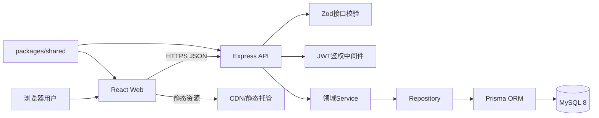
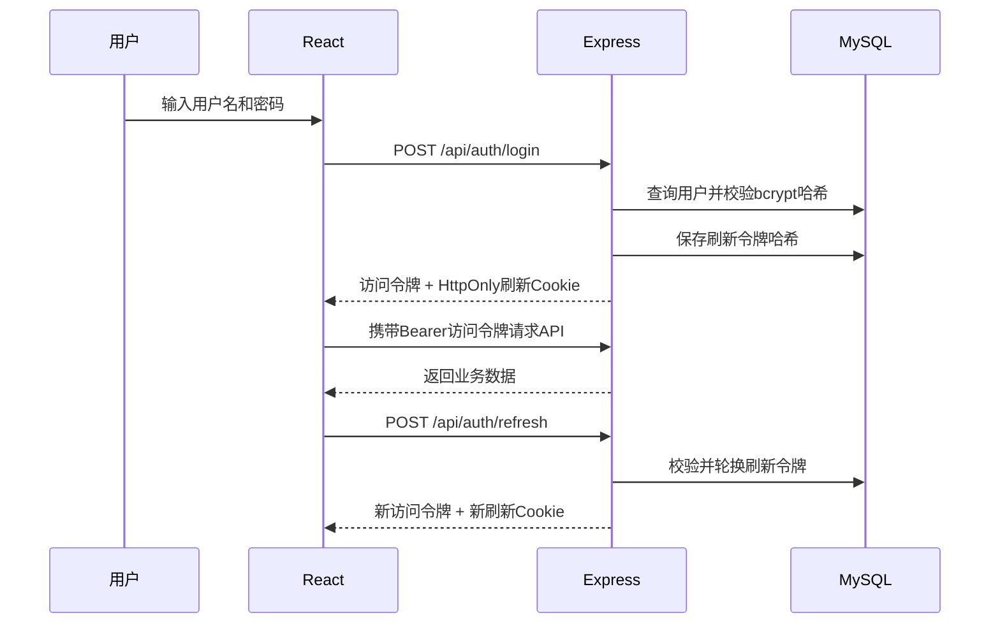
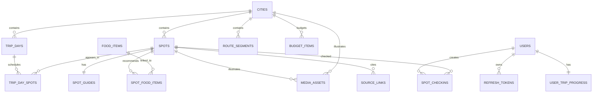
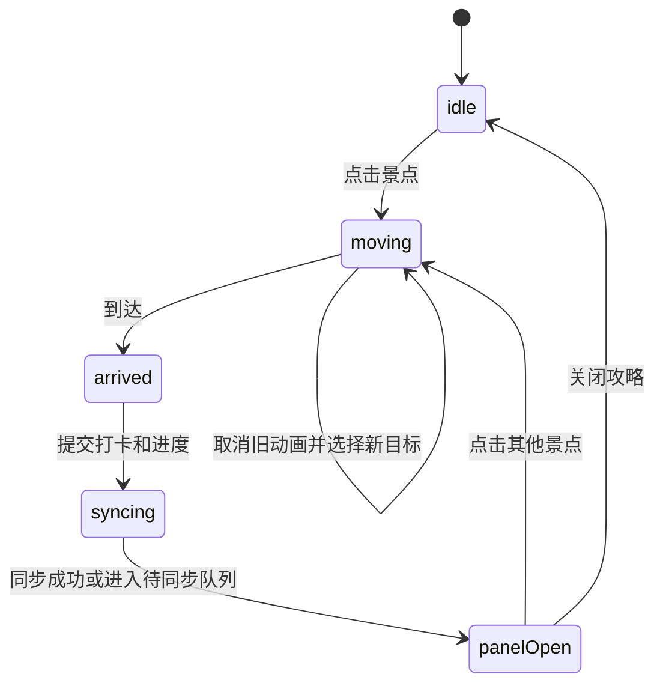

# 漫游山东架构设计

## 1. 文档信息

| 项目 | 内容 |
| --- | --- |
| 项目名称 | 漫游山东 |
| 文档版本 | V2.0 |
| 架构形态 | 前后端分离的pnpm Monorepo |
| 前端 | React、TypeScript、Vite、D3/SVG、Motion |
| 后端 | Node.js、Express、TypeScript、Prisma |
| 数据库 | MySQL 8 |
| 认证 | 用户名密码、JWT访问令牌、HttpOnly刷新令牌Cookie |
| 目标平台 | 手机、平板、桌面浏览器 |

## 2. 架构目标与边界

### 2.1 架构目标

1. 使用统一地图引擎支持山东总览、青岛、泰安和济南四个地图场景。
2. 将城市、景点、路线、攻略、预算和媒体资源持久化到MySQL。
3. 支持用户名密码登录，并跨设备恢复打卡记录和旅行进度。
4. 保证“点击景点、人物移动、到达、打卡、打开攻略、云端同步”的状态一致。
5. 前后端共享类型与Zod校验规则，减少接口契约漂移。
6. 优先保证移动端、键盘操作、低动态模式和异常降级体验。

### 2.2 第一版不包含

- 管理后台；攻略内容通过Prisma种子脚本维护。
- 酒店、车票和门票的在线预订或支付。
- GPS实时导航和真实道路规划。
- 手机短信、邮箱验证及第三方登录。
- 自动采信实时天气、潮汐或票价；只保存来源和核验日期。

## 3. 总体架构



### 3.1 数据流

1. 前端首次加载时请求当前行程及山东总览数据。
2. 进入城市时按需请求城市、日期、景点、路线、攻略、预算和媒体数据。
3. 用户登录后，访问令牌保存在内存，刷新令牌由HttpOnly Cookie管理。
4. 点击景点后，前端先执行人物动画；到达后提交打卡并更新旅行进度。
5. 服务端校验身份与请求数据，通过Prisma事务写入打卡和进度。
6. API失败时前端保留待同步操作，恢复连接后按幂等规则重试。

## 4. 身份认证设计



- 用户名忽略大小写并保持唯一，长度为3至32字符。
- 密码长度为8至72字符，使用bcrypt进行单向哈希。
- 访问令牌有效期15分钟，只保存在前端内存。
- 刷新令牌有效期7天，浏览器端使用 `HttpOnly + Secure + SameSite=Lax` Cookie。
- 数据库只保存刷新令牌SHA-256哈希，不保存原始令牌。
- 刷新时执行令牌轮换；退出时撤销当前刷新令牌并清除Cookie。

## 5. API设计

统一前缀为 `/api`，响应格式为 `{ data, error, requestId }`。所有输入与输出使用 `packages/shared` 中的Zod Schema校验。

| 方法与路径 | 鉴权 | 职责 |
| --- | --- | --- |
| `POST /auth/register` | 否 | 注册账号并创建默认旅行进度 |
| `POST /auth/login` | 否 | 校验账号，签发访问令牌和刷新Cookie |
| `POST /auth/refresh` | Cookie | 轮换刷新令牌并签发新访问令牌 |
| `POST /auth/logout` | Cookie | 撤销刷新令牌并清除Cookie |
| `GET /trips/current` | 否 | 返回当前固定行程及山东总览数据 |
| `GET /cities/:cityId` | 否 | 返回城市、日期、景点、路线、攻略和预算 |
| `GET /spots/:spotId` | 否 | 返回单个景点完整攻略和来源 |
| `GET /users/me/progress` | 是 | 返回用户云端进度和打卡记录 |
| `PUT /users/me/progress` | 是 | 幂等更新当前城市、日期和人物最终位置 |
| `POST /users/me/checkins` | 是 | 幂等创建景点打卡，并在事务中更新进度 |
| `DELETE /users/me/checkins/:spotId` | 是 | 取消指定景点打卡 |

主要状态码：`200/201/204`成功，`400`参数错误，`401`未登录或令牌失效，`404`资源不存在，`409`用户名冲突，`429`请求过多，`500`服务器错误。

## 6. 数据库表设计

### 6.1 ER关系



### 6.2 通用约定

- 主键统一使用 `BIGINT UNSIGNED AUTO_INCREMENT`。
- 时间统一存储为UTC `DATETIME(3)`，API输出ISO 8601。
- 字符集使用 `utf8mb4`，排序规则使用 `utf8mb4_0900_ai_ci`。
- 金额使用 `DECIMAL(10,2)`，禁止浮点类型。
- 公共内容表使用 `created_at`、`updated_at`；需要隐藏的内容使用 `is_active`，不做用户级物理删除。
- 用户删除时受控级联删除令牌、进度和打卡；用户操作不能级联删除城市和景点。

### 6.3 表定义

| 表 | 字段设计 | 约束与索引 | 职责 |
| --- | --- | --- | --- |
| `users` | `id BIGINT UNSIGNED`；`username VARCHAR(32)`；`password_hash VARCHAR(60)`；`display_name VARCHAR(50)`；`status ENUM('ACTIVE','DISABLED') DEFAULT 'ACTIVE'`；`created_at DATETIME(3)`；`updated_at DATETIME(3)` | PK `id`；UQ `username` | 保存账号和密码哈希 |
| `refresh_tokens` | `id BIGINT UNSIGNED`；`user_id BIGINT UNSIGNED`；`token_hash CHAR(64)`；`expires_at DATETIME(3)`；`revoked_at DATETIME(3) NULL`；`user_agent VARCHAR(255) NULL`；`created_at DATETIME(3)` | PK；FK `user_id -> users.id ON DELETE CASCADE`；UQ `token_hash`；IDX `(user_id, expires_at)` | 保存可撤销、可轮换的刷新会话 |
| `cities` | `id BIGINT UNSIGNED`；`slug VARCHAR(32)`；`name VARCHAR(50)`；`summary TEXT`；`longitude DECIMAL(10,7)`；`latitude DECIMAL(10,7)`；`map_asset_key VARCHAR(255)`；`view_box VARCHAR(64)`；`sort_order SMALLINT UNSIGNED`；`is_active BOOLEAN DEFAULT TRUE`；时间字段 | PK；UQ `slug`；IDX `(is_active, sort_order)` | 保存三座城市及地图配置 |
| `trip_days` | `id BIGINT UNSIGNED`；`city_id BIGINT UNSIGNED`；`trip_date DATE`；`title VARCHAR(100)`；`transport_note TEXT NULL`；`sort_order SMALLINT UNSIGNED`；时间字段 | PK；FK `city_id -> cities.id RESTRICT`；UQ `trip_date`；IDX `(city_id, sort_order)` | 保存7月31日至8月4日分日行程 |
| `spots` | `id BIGINT UNSIGNED`；`city_id BIGINT UNSIGNED`；`slug VARCHAR(64)`；`name VARCHAR(100)`；`category ENUM('SIGHT','FOOD','TRANSPORT','EXPERIENCE')`；`map_x DECIMAL(8,4)`；`map_y DECIMAL(8,4)`；`recommended_time VARCHAR(100)`；`duration_minutes SMALLINT UNSIGNED`；`price_min DECIMAL(10,2) NULL`；`price_max DECIMAL(10,2) NULL`；`price_unit ENUM('PERSON','COUPLE','ITEM','FREE','VARIABLE')`；`opening_hours VARCHAR(255) NULL`；`is_active BOOLEAN DEFAULT TRUE`；时间字段 | PK；FK `city_id -> cities.id RESTRICT`；UQ `(city_id, slug)`；IDX `(city_id, category, is_active)` | 保存地图景点及基础游览信息 |
| `trip_day_spots` | `id BIGINT UNSIGNED`；`trip_day_id BIGINT UNSIGNED`；`spot_id BIGINT UNSIGNED`；`visit_order SMALLINT UNSIGNED`；`planned_start TIME NULL`；`planned_end TIME NULL`；`is_optional BOOLEAN DEFAULT FALSE` | PK；FK到 `trip_days`、`spots` 均RESTRICT；UQ `(trip_day_id, spot_id)`；UQ `(trip_day_id, visit_order)` | 保存每日景点顺序和时间 |
| `route_segments` | `id BIGINT UNSIGNED`；`city_id BIGINT UNSIGNED`；`from_spot_id BIGINT UNSIGNED`；`to_spot_id BIGINT UNSIGNED`；`svg_path MEDIUMTEXT`；`duration_ms INT UNSIGNED`；`travel_mode ENUM('WALK','TRANSIT','TRAIN','CLIMB')`；`is_bidirectional BOOLEAN DEFAULT FALSE`；时间字段 | PK；FK城市和起终点景点均RESTRICT；UQ `(city_id, from_spot_id, to_spot_id)`；IDX `to_spot_id` | 保存人物移动的预设SVG路径 |
| `spot_guides` | `id BIGINT UNSIGNED`；`spot_id BIGINT UNSIGNED`；`transport TEXT`；`highlights JSON`；`photo_tips JSON`；`saving_tips JSON`；`safety_notices JSON`；`avoid_pitfalls JSON`；`content_updated_at DATETIME(3)`；时间字段 | PK；FK `spot_id -> spots.id ON DELETE CASCADE`；UQ `spot_id` | 保存单个景点的结构化攻略 |
| `food_items` | `id BIGINT UNSIGNED`；`city_id BIGINT UNSIGNED`；`name VARCHAR(100)`；`description TEXT`；`price_min DECIMAL(10,2) NULL`；`price_max DECIMAL(10,2) NULL`；`recommended_area VARCHAR(150) NULL`；`is_active BOOLEAN DEFAULT TRUE`；时间字段 | PK；FK `city_id -> cities.id RESTRICT`；UQ `(city_id, name)` | 保存城市特色美食和参考价格 |
| `spot_food_items` | `spot_id BIGINT UNSIGNED`；`food_item_id BIGINT UNSIGNED`；`sort_order SMALLINT UNSIGNED DEFAULT 0` | 复合PK `(spot_id, food_item_id)`；两个FK均RESTRICT | 建立景点与美食的多对多关系 |
| `budget_items` | `id BIGINT UNSIGNED`；`city_id BIGINT UNSIGNED NULL`；`category ENUM('ACCOMMODATION','TRANSPORT','TICKET','FOOD','OTHER')`；`title VARCHAR(100)`；`amount_min DECIMAL(10,2)`；`amount_max DECIMAL(10,2)`；`unit ENUM('PERSON','COUPLE','NIGHT','TRIP')`；`note TEXT NULL`；`updated_at DATETIME(3)` | PK；FK `city_id -> cities.id SET NULL`；IDX `(city_id, category)` | 保存两人旅行预算区间 |
| `media_assets` | `id BIGINT UNSIGNED`；`city_id BIGINT UNSIGNED NULL`；`spot_id BIGINT UNSIGNED NULL`；`asset_type ENUM('MAP','ILLUSTRATION','SPRITE','TEXTURE','ICON')`；`asset_key VARCHAR(255)`；`alt_text VARCHAR(255)`；`width INT UNSIGNED NULL`；`height INT UNSIGNED NULL`；`sort_order SMALLINT UNSIGNED DEFAULT 0`；时间字段 | PK；FK城市和景点均 `SET NULL`；UQ `asset_key`；IDX `(city_id, spot_id, asset_type)` | 保存地图、角色和攻略媒体元数据 |
| `source_links` | `id BIGINT UNSIGNED`；`spot_id BIGINT UNSIGNED`；`source_type ENUM('PRICE','HOURS','TIDE','TRANSPORT','OTHER')`；`label VARCHAR(150)`；`url VARCHAR(2048)`；`checked_at DATETIME(3)`；时间字段 | PK；FK `spot_id -> spots.id ON DELETE CASCADE`；IDX `(spot_id, source_type, checked_at)` | 保存易变化信息的来源和核验时间 |
| `user_trip_progress` | `id BIGINT UNSIGNED`；`user_id BIGINT UNSIGNED`；`active_city_id BIGINT UNSIGNED NULL`；`active_trip_day_id BIGINT UNSIGNED NULL`；`character_spot_id BIGINT UNSIGNED NULL`；`progress_version INT UNSIGNED DEFAULT 1`；`updated_at DATETIME(3)` | PK；FK用户 `CASCADE`，其他FK `SET NULL`；UQ `user_id` | 保存用户当前城市、日期和人物最终位置 |
| `spot_checkins` | `id BIGINT UNSIGNED`；`user_id BIGINT UNSIGNED`；`spot_id BIGINT UNSIGNED`；`checked_in_at DATETIME(3)`；`created_at DATETIME(3)` | PK；FK用户 `CASCADE`；FK景点 `RESTRICT`；UQ `(user_id, spot_id)`；IDX `(user_id, checked_in_at)` | 保存用户景点打卡，防止重复记录 |

### 6.4 事务与删除规则

- 注册事务：创建 `users` 与默认 `user_trip_progress`。
- 打卡事务：幂等写入 `spot_checkins`，同时更新 `user_trip_progress`。
- 删除用户：先撤销会话，再级联清理令牌、进度和打卡。
- 城市、景点、路线和攻略为公共数据，只能通过迁移或种子维护，运行时API不提供删除接口。

## 7. 前端状态与动画

运行时状态由 `TripContext + useReducer` 管理：登录用户、当前城市、日期、选中景点、人物位置、目标景点、动画阶段、攻略面板和已打卡集合。



- 人物沿 `route_segments.svg_path` 移动，不能直线穿越海面或山体。
- 动画完成后才产生打卡意图；API使用唯一约束保证幂等。
- 快速连续点击会取消旧动画并以当前可视位置转向新目标。
- 低动态模式直接移动到终点并打开攻略。
- LocalStorage只保存低动态偏好、最后访问路由和待同步队列，不保存JWT和权威打卡状态。

## 8. 项目文件结构与职责

以下为第一版完整规划目录；每个文件右侧说明其唯一主要职责。

```text
gogogo/
├── package.json                         # 定义工作区公共脚本和开发工具
├── pnpm-workspace.yaml                  # 声明apps与packages工作区
├── tsconfig.base.json                   # 提供前后端共享TypeScript配置
├── .env.example                         # 列出数据库、JWT、Cookie和跨域环境变量
├── .gitignore                           # 排除依赖、构建产物、日志和本地密钥
├── docker-compose.yml                   # 启动本地MySQL 8及健康检查
├── README.md                            # 记录安装、迁移、种子、运行、测试与部署命令
├── 项目简介.md                          # 描述产品定位、技术栈和核心功能
├── 架构设计.md                          # 记录本架构、数据库、接口和实施顺序
├── apps/
│   ├── web/
│   │   ├── package.json                 # 定义React应用依赖与脚本
│   │   ├── vite.config.ts               # 配置Vite、代理、别名和构建策略
│   │   ├── tsconfig.json                # 配置浏览器端TypeScript编译
│   │   ├── index.html                   # 提供React挂载节点和基础元信息
│   │   └── src/
│   │       ├── main.tsx                 # 初始化React并挂载根组件
│   │       ├── App.tsx                  # 组合Provider、路由和全局错误边界
│   │       ├── app/router.tsx           # 声明总览、城市、景点和404路由
│   │       ├── app/TripProvider.tsx     # 管理旅行、动画和同步状态
│   │       ├── app/AuthProvider.tsx     # 管理访问令牌、登录恢复和退出
│   │       ├── pages/ShandongPage.tsx   # 渲染山东总览和城市入口
│   │       ├── pages/CityMapPage.tsx    # 渲染复用的城市地图场景
│   │       ├── pages/LoginPage.tsx      # 提供用户名密码登录表单
│   │       ├── pages/RegisterPage.tsx   # 提供注册表单
│   │       ├── pages/NotFoundPage.tsx   # 处理无效路由和资源
│   │       ├── components/map/MapStage.tsx           # 组合地图全部视觉图层
│   │       ├── components/map/ProvinceMap.tsx        # 投影山东GeoJSON并显示城市节点
│   │       ├── components/map/CityMap.tsx            # 显示城市手绘底图和统一viewBox
│   │       ├── components/map/RouteLayer.tsx         # 绘制预设旅行路线
│   │       ├── components/map/SpotMarkerLayer.tsx    # 渲染可访问的景点按钮
│   │       ├── components/map/CharacterLayer.tsx     # 渲染人物精灵和到达动作
│   │       ├── components/guide/GuidePanel.tsx       # 展示当前景点完整攻略
│   │       ├── components/guide/BudgetSection.tsx    # 展示城市和总预算区间
│   │       ├── components/guide/SourceLinks.tsx      # 展示来源与核验日期
│   │       ├── components/trip/CitySwitcher.tsx      # 切换三座城市
│   │       ├── components/trip/DaySelector.tsx       # 切换分日行程
│   │       ├── components/trip/TripProgress.tsx      # 展示云端打卡完成度
│   │       ├── components/trip/TextItinerary.tsx     # 提供无障碍文字版行程
│   │       ├── components/auth/AuthForm.tsx          # 复用登录与注册字段和校验提示
│   │       ├── hooks/useCharacterMovement.ts         # 控制可取消的SVG路径动画
│   │       ├── hooks/useProgressSync.ts               # 同步云端进度和离线待办
│   │       ├── hooks/useReducedMotion.ts              # 读取系统及用户低动态偏好
│   │       ├── services/apiClient.ts                  # 发送请求、附加令牌并统一处理错误
│   │       ├── services/authService.ts                # 封装注册、登录、刷新和退出请求
│   │       ├── services/tripService.ts                # 封装行程、城市和景点读取请求
│   │       ├── services/progressService.ts            # 封装进度与打卡请求
│   │       ├── services/offlineQueue.ts                # 保存和重放短时离线操作
│   │       ├── styles/global.css                       # 定义全局重置与基础排版
│   │       ├── styles/theme.css                        # 定义动漫水彩主题变量
│   │       └── test/setup.ts                           # 初始化前端测试环境
│   └── api/
│       ├── package.json                 # 定义Express、Prisma和测试依赖
│       ├── tsconfig.json                # 配置Node.js TypeScript编译
│       ├── prisma/schema.prisma         # 定义15张表、关系、约束和索引
│       ├── prisma/seed.ts               # 导入固定行程、景点、路线和攻略数据
│       ├── src/server.ts                # 读取配置、启动HTTP服务并处理关闭信号
│       ├── src/app.ts                   # 组装Express中间件、路由和错误处理
│       ├── src/config/env.ts            # 使用Zod校验服务端环境变量
│       ├── src/config/auth.ts           # 集中定义JWT和Cookie安全参数
│       ├── src/lib/prisma.ts            # 创建并复用PrismaClient实例
│       ├── src/lib/logger.ts            # 输出结构化应用日志和请求ID
│       ├── src/middleware/authenticate.ts # 校验Bearer访问令牌并注入用户身份
│       ├── src/middleware/errorHandler.ts # 将领域错误转换为统一API响应
│       ├── src/middleware/rateLimit.ts    # 限制注册、登录和刷新接口频率
│       ├── src/middleware/requestId.ts    # 为每个请求生成追踪ID
│       ├── src/routes/index.ts            # 汇总并挂载全部模块路由
│       ├── src/modules/auth/auth.routes.ts       # 声明认证端点
│       ├── src/modules/auth/auth.controller.ts   # 解析认证请求并返回HTTP响应
│       ├── src/modules/auth/auth.service.ts      # 处理密码、JWT和令牌轮换规则
│       ├── src/modules/auth/auth.repository.ts   # 查询用户并持久化刷新令牌
│       ├── src/modules/trip/trip.routes.ts       # 声明行程、城市和景点端点
│       ├── src/modules/trip/trip.controller.ts   # 处理只读攻略请求
│       ├── src/modules/trip/trip.service.ts      # 聚合城市、路线、攻略和预算数据
│       ├── src/modules/trip/trip.repository.ts   # 使用Prisma查询公共旅行数据
│       ├── src/modules/progress/progress.routes.ts     # 声明用户进度和打卡端点
│       ├── src/modules/progress/progress.controller.ts # 处理进度HTTP请求
│       ├── src/modules/progress/progress.service.ts    # 实现打卡事务和进度规则
│       ├── src/modules/progress/progress.repository.ts # 持久化进度和打卡数据
│       └── test/integration.setup.ts      # 建立API数据库集成测试环境
└── packages/
    └── shared/
        ├── package.json                   # 定义共享包导出和构建脚本
        ├── tsconfig.json                  # 配置共享包TypeScript编译
        └── src/
            ├── index.ts                   # 统一导出共享类型、Schema和常量
            ├── types/auth.ts              # 定义用户、令牌和会话类型
            ├── types/trip.ts              # 定义城市、日期、景点和路线类型
            ├── types/progress.ts          # 定义进度和打卡类型
            ├── schemas/auth.ts            # 校验注册、登录和认证响应
            ├── schemas/trip.ts            # 校验攻略查询响应
            ├── schemas/progress.ts        # 校验进度和打卡请求响应
            └── constants/routes.ts        # 维护共享API路径常量
```

测试文件与被测模块同目录，统一命名为 `*.test.ts(x)`；端到端测试位于 `apps/web/e2e/*.spec.ts`，不在目录树中逐个枚举具体场景文件。

## 9. 异常、安全与一致性

- API错误统一包含稳定错误码、用户可读消息和 `requestId`，不泄露堆栈与数据库细节。
- 所有写接口先鉴权再校验数据；登录和刷新接口启用限流。
- Prisma查询使用参数化语句；Zod拒绝未知或越界字段。
- 密码、JWT密钥、数据库地址和Cookie密钥只来自环境变量。
- 前端遇到 `401` 时只自动刷新一次，失败后清空内存令牌并跳转登录页。
- 打卡依赖 `(user_id, spot_id)` 唯一约束；重复提交返回现有结果，不产生重复数据。
- 地图或动画失败时降级为文字版行程；打卡API失败时保留明确的待同步状态。

## 10. 测试策略

### 10.1 单元测试

- Reducer的城市切换、动画完成、取消、打卡和退出清理。
- JWT签发验证、密码校验和刷新令牌轮换。
- 路线查找、多段路径组合和预算计算。
- Zod Schema对合法、缺失和越界输入的处理。

### 10.2 数据库与API集成测试

- 注册同时创建默认进度，重复用户名返回409。
- 登录失败不泄露用户是否存在，成功后只保存令牌哈希。
- 刷新令牌只能使用一次，退出后不可再次刷新。
- 重复打卡不产生重复记录；打卡与进度更新处于同一事务。
- 普通用户无法读取或修改其他用户的进度。
- 删除用户后令牌、进度和打卡被清理，公共攻略仍保留。

### 10.3 端到端测试

- 注册、登录、山东总览、三城切换、景点移动和攻略打开。
- 快速连续点击景点时，最终人物位置和攻略一致。
- 刷新页面及另一浏览器登录后恢复云端进度。
- 离线打卡恢复网络后成功同步。
- 手机和桌面视口无文字重叠、地图空白或不可点击区域。
- 低动态模式跳过移动动画但保留完整功能。

## 11. 实现步骤顺序

后续开发必须按以下顺序推进；每一步通过对应检查后再进入下一步。

1. **初始化工作区**：创建pnpm Monorepo、基础TypeScript配置、前端、后端和共享包；验证所有包可独立类型检查。
2. **建立数据库基础**：配置Docker Compose MySQL、Prisma Schema和环境变量校验；生成首个迁移并验证15张表、外键和索引。
3. **导入基础内容**：编写幂等种子脚本，导入三座城市、五天行程、景点、路线、攻略、美食、预算和来源。
4. **实现认证闭环**：按测试优先顺序完成注册、登录、访问令牌、刷新轮换、退出、限流和鉴权中间件。
5. **实现只读攻略API**：完成当前行程、城市聚合和单景点接口，确保响应通过共享Schema校验。
6. **实现进度API**：完成进度读取、幂等更新、打卡事务和取消打卡，并验证用户数据隔离。
7. **建立前端基础设施**：完成路由、API客户端、AuthProvider、TripProvider、错误边界和401单次刷新机制。
8. **实现地图场景**：先完成山东总览，再实现通用城市地图、路线层和景点层，校验所有坐标和资源非空。
9. **实现人物动画与攻略**：完成可取消SVG路径动画、到达动作、攻略面板和深层景点URL。
10. **接入云端同步**：在动画完成后提交打卡和进度，加入待同步队列、幂等重试与跨设备恢复。
11. **完善体验**：实现手机底部抽屉、键盘导航、文字版行程、低动态模式、图片替代文本和资源懒加载。
12. **完成质量验证**：运行单元、API集成、数据库约束和Playwright端到端测试，检查桌面与移动端截图及动画终态。
13. **部署与发布**：使用Docker Compose完成本地联调；构建前端静态资源，部署Express API和MySQL，配置HTTPS、CORS、Cookie域名、迁移和种子流程。

## 12. 部署设计

- 开发环境：pnpm启动Web与API，Docker Compose启动MySQL。
- 测试环境：使用独立MySQL数据库，每次集成测试前执行迁移并重置测试数据。
- 生产环境：前端部署到静态托管平台；Express运行于Node.js LTS；MySQL 8使用托管实例或持久化容器。
- 部署顺序：数据库备份与迁移、API健康检查、前端发布、核心流程冒烟测试。
- SPA托管必须将未知前端路径回退到 `index.html`；API路径不得参与该回退。

## 13. 验收标准

- 两份文档对前后端技术栈、MySQL持久化、云端进度和部署形态的描述保持一致。
- 数据库章节完整覆盖15张表、字段类型、主外键、唯一约束、索引、默认值和删除策略。
- 项目目录覆盖根目录、前端、后端、Prisma和共享包，并说明每个规划文件的职责。
- API、认证、数据流、人物动画、打卡事务和异常降级有明确实现边界。
- 实现步骤顺序可直接交给开发人员执行，无需再次决定技术栈或模块边界。
- 测试覆盖注册登录、刷新轮换、攻略查询、重复打卡、跨设备恢复、未授权访问、动画中断和响应式布局。
